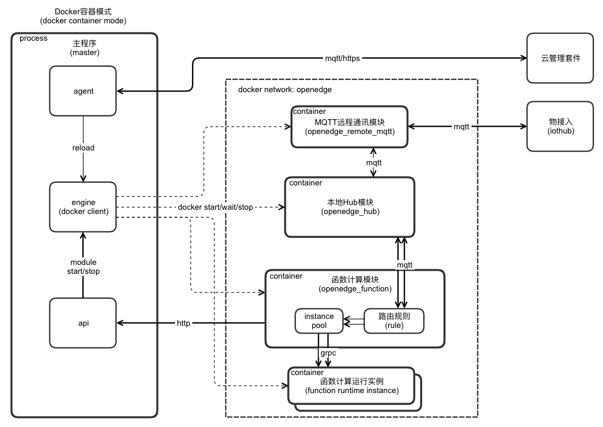
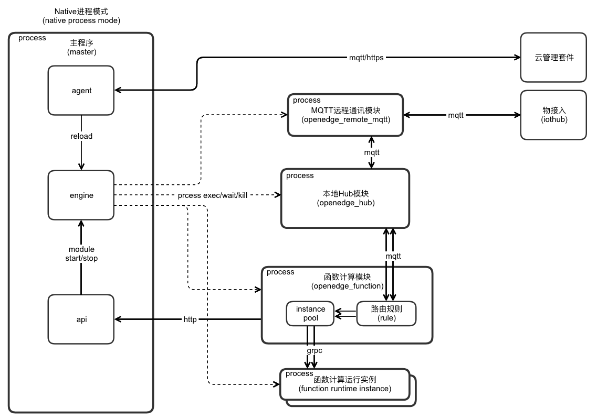

# OpenEdge

[](https://travis-ci.com/baidu/openedge)


[README in Chinese](./README-CN.md)

**[OpenEdge](https://openedge.tech) is an open edge computing framework that extends cloud computing, data and service seamlessly to edge devices.** It can provide temporary offline, low-latency computing services, and include device connect, message routing, remote synchronization, function computing, video access pre-processing, AI inference, etc. The combianation of OpenEdge and the **Cloud Management Suite** of [BIE](https://cloud.baidu.com/product/bie.html)(Baidu IntelliEdge) will achieve cloud management and application distribution, enable applications running on edge devices and meet all kinds of edge computing scenario.

## Design

About architecture design, OpenEdge takes **modularization** and **containerization** design mode. Based on the modular design pattern, OpenEdge splits the product to multiple modules, and make sure each one of them is a separate, independent module. In general, OpenEdge can fully meet the conscientious needs of users to deploy on demand. Besides, OpenEdge also takes containerization design mode to build images. Due to the cross-platform characteristics of docker to ensure the running environment of each operating system is consistent. In addition, **OpenEdge also isolates and limits the container resources of docker containerization**, and allocates the CPU, memory and other resources of each running instance accurately to improve the efficiency of resource utilization.

### Docker containerization mode



### Native process mode



## Concepts

OpenEdge is made up of **main program module, local hub module, local function module, MQTT remote module and Python2.7 runtime module.** The main capabilities of each module are as follows:

> + **Main program module** is used to manage all modules's behavior, such as start, stop, etc. And it is composed of module engine, API and cloud agent.
>   + **Module engine** controls the behavior of all modules, such as start, stop, restart, listen, etc, and currently supports **docker containerization mode** and **native process mode**.
>   + **Cloud agent** is responsible for the communication with **Cloud Management Suite** of [BIE](https://cloud.baidu.com/product/bie.html), and supports MQTT and HTTPS protocols. In addition, if you use MQTT protocol for communication, **must** take two-way authentication of SSL/TLS; otherwise, you **must** take one-way authentication of SSL/TLS due to HTTPS protocol. 
>   + The main program exposes a set of **HTTP API**, which currently supports to start, stop and restart module, also can get free port.
> + **local hub module** is based on [MQTT](http://docs.oasis-open.org/mqtt/mqtt/v3.1.1/os/mqtt-v3.1.1-os.html) protocol, which supports four connect modes, including **TCP**、**SSL(TCP+SSL)**、**WS(Websocket)** and **WSS(Websocket+SSL).**
> + **local function module** provides a high flexible, high available, rich scalable and quickly responsible power due to MQTT protocol. Functions are executed by one or more instances, each of them is a separate process. GRPC Server is used to run a function instance.
> + **MQTT remote module** supports MQTT protocol, can be used to synchronize messages with remote hub. In fact, it is two MQTT Server Bridge modules, which are used to subscribe to messages from one Server and forward them to the other.
> + **Python2.7 runtime module** is an implementation of **local function module**. So developers can write python script to handler messages, such as filter, exchange, forward, etc. 

## Features

> + support module management, include start, stop, restart, listen and upgrade
> + support two mode: **docker containerization mode** and **native process mode**
> + docker containerization mode support resources isolation and restriction
> + support cloud management suite, which can be used to report device hardware information and deploy configuration
> + provide **local hub module**, which supports MQTT v3.1.1 protocol, qos 0 or 1, SSL/TLS authentication
> + provide **local function module**, which supports function instance scaling, **Python2.7** runtime and customize runtime
> + provide **MQTT remote module**, which supports MQTT v3.1.1 protocol
> + provide **module SDK(Golang)**, which can be used to develop customize module

## Advantages

> + **Shielding computing framework**: OpenEdge provides two official computing modules(**local function module** and **Python2.7 rutime module**), also supports customize module(which can be written in any programming language or any machine learning framework).
> + **Simplified application production**: OpenEdge combines with **Cloud Management Suite** of BIE and many other productions of Baidu Cloud(such as [CFC](https://cloud.baidu.com/product/cfc.html), [Infinite](https://cloud.baidu.com/product/infinite.html), [Jarvis](http://di.baidu.com/product/jarvis?castk=LTE%3D), [IoT EasyInsight](https://cloud.baidu.com/product/ist.html), [TSDB](https://cloud.baidu.com/product/tsdb.html), [IoT Visualization](https://cloud.baidu.com/product/iotviz.html)) to provide data calculation, storage, visible display, model training and many more abilities.
> + **Quickly deployment**: OpenEdge pursues docker containerization mode, it make developers quickly deploy OpenEdge on different operating system.
> + **Deploy on demand**: OpenEdge takes modularizaiton mode and splits functions to multiple independent modules. Developers can select some modules which they need to deploy.  
> + **Rich configuration**: OpenEdge supports X86 and ARM CPU processers, as well as Linux, Darwin and Windows operating systems.

# Getting Started

## Requirements

### Running environment requirements

Install Docker if running openedge in **Docker Container** mode (recommend)

1. Install Docker

   **For Linux([support multiple platforms](./doc/us-en/setup/Support-platforms.md), recommended)**
   ```shell
   curl -sSL https://get.docker.com | sh
   ```

   **For Ubuntu**
   ```shell
   # Install Docker from Ubuntu's repositories
   sudo apt-get update
   sudo snap install -y docker # Ubuntu16.04 after
   sudo apt install -y docker.io # Ubuntu 16.04 before

   # or install Docker CE from Docker's repositories for Ubuntu
   sudo apt-get update && sudo apt-get install apt-transport-https ca-certificates curl software-properties-common
   curl -fsSL https://download.docker.com/linux/ubuntu/gpg | apt-key add -
   add-apt-repository \
        "deb [arch=amd64] https://download.docker.com/linux/ubuntu \
        $(lsb_release -cs) \
        stable"
   sudo apt-get update && sudo apt-get install docker-ce
   ```

   **For CentOS**
   ```shell
   # Install Docker from CentOS/RHEL repository
   yum install -y docker

   # or install Docker CE from Docker's CentOS repositories
   yum install yum-utils device-mapper-persistent-data lvm2
   yum-config-manager \
        --add-repo \
        https://download.docker.com/linux/centos/docker-ce.repo
   yum update && yum install docker-ce
   ```

   **For Debian**
   ```shell
   # Install Docker from Debian's repositories
   sudo apt-get update
   sudo apt-get install -y dockerio
   
   # or install Docker CE from Docker's Debian repositories
   # Debian 8 jessie or Debian 9 stretch
   sudo apt-get update && sudo apt-get install \
        apt-transport-https \
        ca-certificates \
        curl \
        gnupg2 \
        lsb-release \
        software-properties-common
   # Debian 7 Wheezy
   sudo apt-get update && sudo apt-get install \
        apt-transport-https \
        ca-certificates \
        curl \
        lsb-release \
        python-software-properties
   
   curl -fsSL https://download.docker.com/linux/debian/gpg | sudo apt-key add -

   # add docker-ce-repository to sources.list
   sudo add-apt-repository \
        "deb [arch=amd64] https://download.docker.com/linux/debian \
        $(lsb_release -cs) \
        stable"

   # Only for Debian 7 Wheezy, comment below line use "#"
   deb-src [arch=amd64] https://download.docker.com/linux/debian wheezy stable

   # install docker-ce
   sudo apt-get update
   sudo apt-get install -y docker-ce
   ```

   **For Darwin**
   ```shell
   # Install Homebrew
   /usr/bin/ruby -e "$(curl -fsSL https://raw.githubusercontent.com/Homebrew/install/master/install)"

   # Instal docker
   brew tap caskroom/cask
   brew cask install docker
   ```

2. Install python and python runtime requirements

> If you want to run OpenEdge with **Native Process** Mode you should install python 2.7 on your machine with the modules it depends on.

   **For Ubuntu or Debian**
   ```shell
   # Check python is installed or not
   python -V

   # If not installed, install it
   sudo apt-get update
   sudo apt-get install python python-pip
   sudo pip install protobuf grpcio
   ```
   
   **For CentOS**
   ```shell
   # Check python is installed or not
   python -V

   # If python is not installed, install it
   sudo yum install python python-pip
   sudo pip install protobuf grpcio
   ```
   
   **For Darwin**
   ```shell
   # Check python is installed or not
   python -V

   # If not installed, install it
   brew install python@2
   pip install protobuf grpcio
   ```

### Developing environment requirements

Eexcept docker and python application as above mentioned, if you want to build OpenEdge from source or contribute code to OpenEdge, you also need install golang.

In addition, OpenEdge need the version of golang is higher than 1.10. So, you can install golang use below command.

1. For Linux

   You should download the golang from [download-page](https://golang.org/dl/) first.
   ```shell
   # Extract golang to /usr/local(or a specfied directory)
   tar -C /usr/local -zxf go$VERSION.linux-$ARCH.tar.gz

   # Set GOPATH(such as ~/.bashrc)
   export PATH=$PATH:/usr/local/go/bin
   export GOPATH=yourpath
   ```

2. For Darwin

   ```shell
   # Install golang
   brew install go

   # Set GOPATH, GOROOT(such as ~/.bash_profile)
   export GOPATH="${HOME}/go"
   export GOROOT="$(brew --prefix golang)/libexec"
   export PATH="$PATH:${GOPATH}/bin:${GOROOT}/bin"

   # Source GOPATH, GOROOT
   source yourfile

   # Set GOPATH directory
   test -d "${GOPATH}" || mkdir "${GOPATH}"
   ```

   Show golang version and golang environment:
   ```shell
   go env # show golang environment
   go version # show golang version
   ```

## Build

   You must download OpenEdge executable from [Release-page](https://github.com/baidu/openedge/releases) first.
   ```shell
   # Extract OpenEdge
   tar -zxvf /path/to/openege-$OS-$ARCH-$VERSION.tar.gz /path/to/openedge/extract

   # Eexecute
   cd /path/to/openedge/extract
   bin/openedge -w . # Run OpenEdge in Docker containerization mode(OpenEdge official only support)
   ```
   
   If you want to run OpenEdge in **Native process mode**, please build OpenEdge and other module first.
   ```shell
   # Clone OpenEdge source code
   go get github.com/baidu/openedge

   # Build OpenEdge from source
   make

   # Build local Docker image
   make images

   # Install OpenEdge(default directory /usr/local)
   make PFEFIX=yourpath install 

   # Uninstall OpenEdge 
   make PFEFIX=yourpath uninstall

   # Clean log
   make PFEFIX=yourpath clean
   ```

## Usage

   ```shell
   # Run OpenEdge in Docker containerization mode(such as install OpenEdge in $GOPATH/src/github.com/baidu/openedge/output)
   cd $GOPATH/src/github.com/baidu/openedge
   output/bin/openedge -w example/docker

   # Run OpenEdge in Native process mode
   output/bin/openedge
   ```

# Running the tests

   ```shell
   make test
   ```

# Contributing

If you are passionate about contributing to open source community, OpenEdge will provide you with both code contributions and document contributions. More details, please see: [How to contribute code or document to OpenEdge](./doc/us-en/about/How-to-contribute.md).

# Copyright and License

OpenEdge is provided under the [Apache-2.0 license](./LICENSE).

# Discussion

As the first open edge computing framework in China, OpenEdge aims to create a lightweight, secure, reliable and scalable edge computing community that will create a good ecological environment. Here, we offer the following options for you to choose from:

> + If you have more about feature requirements or bug feedback of OpenEdge, please [Submmit an issue](https://github.com/baidu/openedge/issues)
> + If you have better development advice about OpenEdge, please contact us: [contact@openedge.tech](contact@openedge.tech)