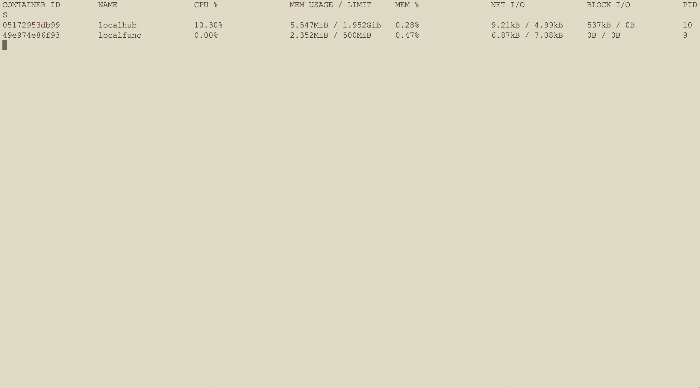

# Install OpenEdge on Linux

> OpenEdge is mainly developed in Go programming language and supports two startup modes: ***docker*** container mode and ***native*** process mode.

This document focuses on the installation and configuration of the environment required for OpenEdge and the rapid deployment of OpenEdge on the Linux-like system.

## Environment Configuration

### Install Docker

> OpenEdge offers two startup modes. To start using ***docker*** container mode (recommended), you need to complete the docker installation first.

**Notice:**

+ The official Dockerfile is offered for multi-stage builds. If you need to build the relevant image yourself, The version of docker you installed should be above 17.05.
+ The production environment can run the image using a lower version of Docker, which is currently tested to a minimum usable version of 12.0.
+ According to the [Official Release Log](https://docs.docker.com/engine/release-notes/#18092), the version of docker version < 18.09.2 has some security implications. It is recommended to install/update the Docker version to 18.09. 2 and above.

Can be installed by the following command(Suitable for linux-like systems, [Supported Platforms](./Support-platforms.md)):

```shell
curl -sSL https://get.docker.com | sh
```

#### Ubuntu

Command:

```shell
sudo snap install docker # Ubuntu16.04 after
sudo apt install docker.io # Ubuntu 16.04 before
```

#### CentOS

Command:

```shell
yum install docker
```

***Notice***: 

+ After the Docker installation is complete, use the following command to view the installed Docker version.

```shell
docker version
```

#### Debian 9/Raspberry Pi 3

Command:

```shell
curl -sSL https://get.docker.com | sh
```

**For more details, please see the [official documentation](https://docs.docker.com/install/).**

### Install Python2.7 and Python runtime dependency package

> + OpenEdge provides Python Runtime, which supports running code written in Python version 2.7. If you plan to start using ***native*** process mode, you need to install Python 2.7 and the package you depend on. If you plan to start in ***docker*** container mode, you do not need to perform the following steps.

#### Ubuntu 18.04 LTS/Debian 9/Raspberry Pi 3

Commands:

```shell
sudo apt update
sudo apt upgrade
sudo apt install python2.7
sudo apt install python-pip
sudo pip install protobuf grpcio
```

#### CentOs 

Execute the following command to check the installed Python version:

```shell
python -V
```

If the result is not installed, you can install it using the following command:

```shell
yum install python
yum install python-pip
yum install protobuf grpcio
```

Or install from source code:

```shell
yum install gcc openssl-devel bzip2-devel
wget https://www.python.org/ftp/python/2.7.15/Python-2.7.15.tgz
tar xzf Python-2.7.15.tgz
make altinstall
curl "https://bootstrap.pypa.io/get-pip.py" -o "get-pip.py"
python2.7 get-pip.py
pip install protobuf grpcio
```

> Enter the command `python -V` to see that the Python version is 2.7.* and the installation is correct.

### Specify the default Python version

In some cases, you need to specify the default Python version for the above installed version. Complete with the following command (Valid after reboot):

```shell
alias python=/yourpath/python2.7
```

## Deploy OpenEdge

### Preparation Before Deployment

**Statement**:

+ The following is an example of the deployment and startup of OpenEdge on Ubuntu system. The deployment operations on other Linux distributions are basically the same as the following descriptions. It is assumed that the environment required for OpenEdge operation has been configured [before](#Environment-Configuration).
+ The Ubuntu system mentioned below is based on the Linux Ubuntu 4.15.0-29-generic version of the kernel with a CPU architecture of x86_64. Execute command `uname -ar` and get the result like this:


Starting OpenEdge containerization mode requires the running device to complete the installation and operation of Docker. You can install it by referring to [Steps above](#Install-Docker).

### Deployment Process

- **Step1**: [Download](../Resources-download.md) OpenEdge archive;
- **Step2**: Open the terminal and enter the OpenEdge directory for decompression:
	- execute command `tar -zxvf openedge-xxx.tar.gz`;
- **Step3**: After the decompression operation is completed, enter the OpenEdge package directory in the terminal, open a new terminal at the same time, execute the command `docker stats`, display the running status of the container in the installted docker, and then execute the command `bin/openedge -w .`, respectively. Observe the contents displayed by the two terminals;
- **Step4**: If the results are consistent, it means that OpenEdge has started normally.

***Notice:*** The official download page only provides the docker mode executable file. If you want to run in process mode, please refer to [Build-OpenEdge-From-Source.md](./Build-OpenEdge-from-Source.md)

### Start deployment

As mentioned above, download OpenEdge archive from the [Download page](../Resources-download.md) first (also can compile from source, see [Build-OpenEdge-From-Source.md](./Build-OpenEdge-from-Source.md)), then open the terminal to enter OpenEdge directory for decompression. After successful decompression, you can find that the openedge directory mainly includes bin, etc, var, etc., as shown in the following picture:


The bin directory stores the openedge executable binary file, the etc directory stores the configuration of OpenEdge, and the var directory stores the configuration and resources for the modules of OpenEdge.

Then, open a new terminal and execute the command `docker stats` to view the running status of the container in the installted docker, as shown in the following picture:


It can be found that the current system does not have a docker container running.

Then, go to the decompressed OpenEdge folder, execute the command `bin/openedge -w .` in the another terminal, observe the log of OpenEdge startup, as shown below:


At the same time, observe the terminal that shows the running status of the container, as shown in the following picture:



Obviously, OpenEdge has been successfully launched.

As mentioned above, if the steps are executed correctly, OpenEdge can be quickly deployed and started on the Ubuntu system. And operations on other Linux distributions are similar to the above.