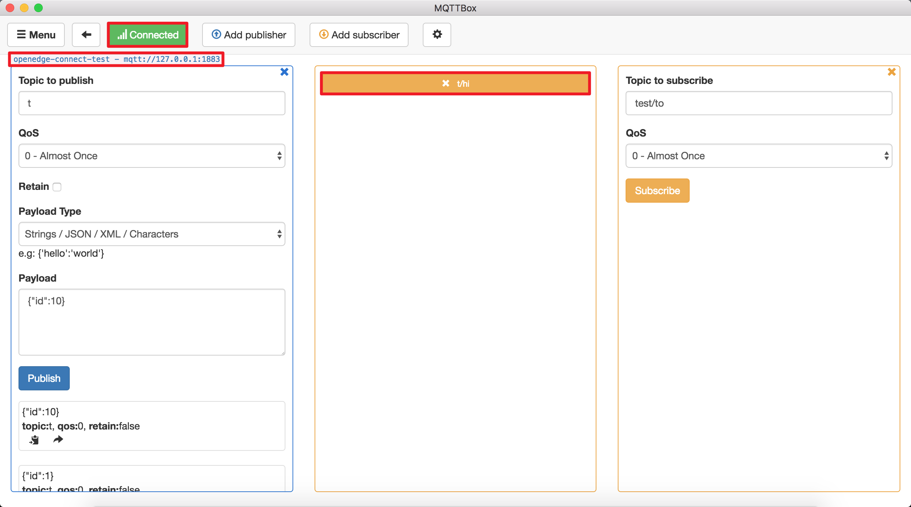

# Message handling with Local Function Module

**Statement**

> + The operating system as mentioned in this document is Darwin.
> + The MQTT client toolkit as mentioned in this document is [MQTTBOX](../Resources-download.md#mqttbox-download).
> + The docker image used in this document is compiled from the OpenEdge source code. More detailed contents please refer to [Build OpenEdge from source](../setup/Build-OpenEdge-from-Source.md)

Different from the Local Hub Module to transfer message among devices(mqtt clients), this document describes the message handling with Local Function Module(also include Local Hub Module and Pyton27 Runtime Module). In the document, Local Hub Module is used to establish connection between OpenEdge and mqtt client, Python27 Runtime Module is used to hanle MQTT messages, and the Local Function Module is used to combine Local Hub Module with Python27 Runtime Module with message context.

This document will take the TCP connection mode as an example to show the message handling, calculation and forwarding with Local Function Module.

## Workflow

- Step 1：Startup OpenEdge in docker container mode.
- Step 2：MQTTBOX connect to Local Hub Module by TCP connection mode, more detailed contents please refer to [Device connect to OpenEdge with Local Hub Module](./Device-connect-to-OpenEdge-with-hub-module.md)
    - If connect successfully, then subscribe the MQTT topic due to the configuration of Local Hub Module, and observe the log of OpenEdge.
        - If the OpenEdge's log shows that the Python Runtime Module has been started, it indicates that the published message was handled by the specified function.
        - If the OpenEdge's log shows that the Python Runtime Module has not been started, then retry it until the Python Runtime Module has been started.
    - If connect unsuccessfully, then retry `Step 2` operation until it connect successfully
- Step 3：Check the publishing and receiving messages via MQTTBOX.


## Message Handling Test

The configuration of the Local Hub Module and the Local Function Module used in the test is as follows:

```yaml
# The configuration of Local Hub Module
name: localhub
listen:
  - tcp://:1883
principals:
  - username: 'test'
    password: 'be178c0543eb17f5f3043021c9e5fcf30285e557a4fc309cce97ff9ca6182912'
    permissions:
      - action: 'pub'
        permit: ['#']
      - action: 'sub'
        permit: ['#']

# The configuration of Local Function Module
name: localfunc
hub:
  address: tcp:/hub:1883
  username: test
  password: hahaha
rules:
  - id: rule-e1iluuac1
    subscribe:
      topic: t
      qos: 1
    compute:
      function: sayhi
    publish:
      topic: t/hi
      qos: 1
functions:
  - id: func-nyeosbbch
    name: 'sayhi'
    runtime: 'python27'
    handler: 'sayhi.handler'
    codedir: 'var/db/openedge/module/func-nyeosbbch'
    entry: "openedge-function-runtime-python27:build"
    env:
      USER_ID: acuiot
    instance:
      min: 0
      max: 10
      timeout: 1m
```

As configured above, if the MQTTBOX has established a connection with OpenEdge via the Local Hub Module, the message published to the topic `t` will be handled by `sayhi` function, and the result will be published to the Local Hub Module with the topic `t/hi`. At the same time, the MQTT client subscribed the topic `t/hi` will receive the result message.

_**NOTE**: Any function that appears in the `rules` configuration must be configured in the `functions` configuration, otherwise OpenEdge will not be started._

### OpenEdge Start

As described in `Step 1`, OpenEdge starts with docker container mode. And it can be found that OpenEdge is starting via OpenEdge's log. More detailed contents are as follows:


Also, we can execute the command `docker ps` to view the list of docker containers currently running.


After comparison, it is not difficult to find that the two container modules of the Local Hub Module and the Local Function Module have been successfully loaded at the time of OpenEdge startup.

### MQTTBOX Establish a Connection with OpenEdge

Here, using MQTTBOX as the MQTT client, click the `Add subscriber` button to subscribe the topic `t/hi`. And topic `t/hi` is used to receive the result message after `sayhi` function handled. More detailed contents are as shown below.



The figure above shows that MQTTBOX has successfully subscribed the topic `t/hi`.

### Message Handling Check

Based on the above, here we use the Python function `sayhi` to handle the message of the topic `t` and publish the result back to the topic `t/hi`. More detailed contents of function `sayhi` are as shown below.

```python
#!/usr/bin/env python
#-*- coding:utf-8 -*-
"""
module to say hi
"""

import os


def handler(event, context):
    """
    function handler
    """
    if 'USER_ID' in os.environ:
      event['USER_ID'] = os.environ['USER_ID']

    if 'functionName' in context:
      event['functionName'] = context['functionName']

    if 'functionInvokeID' in context:
      event['functionInvokeID'] = context['functionInvokeID']

    if 'invokeid' in context:
      event['invokeid'] = context['invokeid']

    if 'messageQOS' in context:
      event['messageQOS'] = context['messageQOS']

    if 'messageTopic' in context:
      event['messageTopic'] = context['messageTopic']

    event['py'] = '你好，世界！'

    return event
```

It can be found that after receiving a message in a dictionary(`dict`) format, the function `sayhi` will handle it and then return the result. The returned result include: environment variable `USER_ID`, function name `functionName`, function call ID `functionInvokeID`, input message subject `messageTopic`, input message message QoS `messageQOS` and other fields.

Here, we publish the message `{"id":10}` to the topic `t` via MQTTBOX, and then observe the receiving message of the topic `t/hi`. More detailed contents are as shown below.


It is not difficult to find that the result received by MQTTBOX via the topic `t/hi` is consistent with the above analysis.

In addition, we can observe the OpenEdge's log and execute the command `docker ps` again to view the list of containers currently running on the system. The results are shown below.


As you can see from the above two figures, except the Local Hub Module and the Local Function Module were loaded when OpenEdge started, the Python Runtime Module was also loaded when the MQTT message of topic `t` was handled by function `sayhi`. More detailed designed contents of Python Runtime Module please refer to [OpenEdge design](../overview/OpenEdge-design.md).