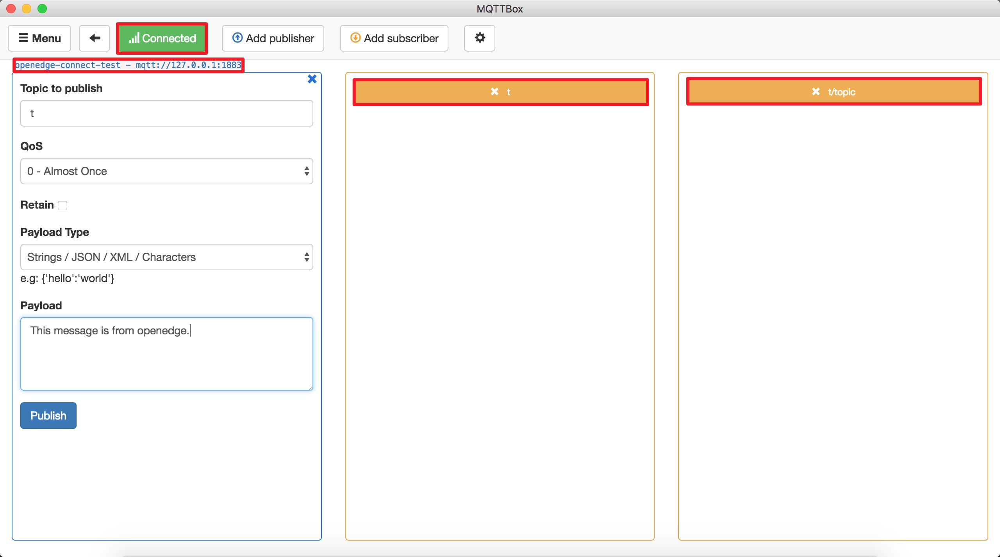
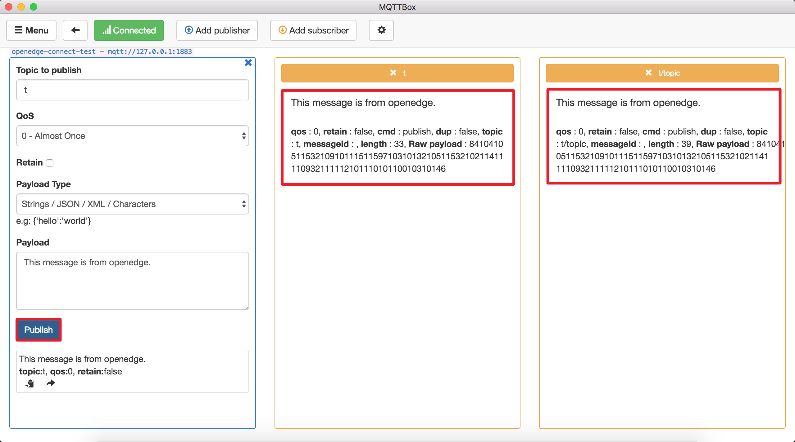

# Messgae transfering among devices with Local Hub Module

**Statement**

> + The operating system as mentioned in this document is Darwin.
> + The MQTT client toolkit as mentioned in this document is [MQTTBOX](../Resources-download.md#mqttbox-download).

Different from [Device-connect-to-OpenEdge-with-hub-module](./Device-connect-to-OpenEdge-with-hub-module.md), if you want to transfer MQTT messages among multiple MQTT clients, you need to configure the connect information, topic permission, and router rules. More detailed configuration of Hub module, please refer to [Hub module configuration](./Config-interpretation.md#local-hub-configuration).

This document uses the TCP connection mode as an example to test the message routing and forwarding capabilities of the Local Hub Module.

## Workflow

- Step 1：Startup OpenEdge in docker container mode.
- Step 2：MQTTBOX connect to Local Hub Module by TCP connection mode, more detailed contents please refer to [Device connect to OpenEdge with Local Hub Module](./Device-connect-to-OpenEdge-with-hub-module.md).
    - If connect successfully, then subscribe the MQTT topic due to the configuration of Local Hub Module.
    - If connect unsuccessfully, then retry `Step 2` operation until it connect successfully.
- Step 3：Check the publishing and receiving messages via MQTTBOX.

## Message Routing Test

The configuration of the Local Hub Module used in the test is as follows:

```yaml
name: openedge-hub
listen:
  - tcp://:1883
principals:
  - username: 'test'
    password: 'be178c0543eb17f5f3043021c9e5fcf30285e557a4fc309cce97ff9ca6182912'
    permissions:
      - action: 'pub'
        permit: ['#']
      - action: 'sub'
        permit: ['#']
subscriptions:
  - source:
      topic: 't'
    target:
      topic: 't/topic'
```

As configured above, message routing rules depends on the `subscriptions` configuration item, which means that messages published to the topic `t` will be forwarded to all devices(users, or mqtt clients) that subscribe the topic `t/topic`.

_**NOTE**: In the above configuration, the permitted topics which are configured in `permit` item support the `+` and `#` wildcards configuration. More detailed contents of `+` and `#` wildcards will be explained as follows._

**`#` wildcard**

For [MQTT protocol](http://docs.oasis-open.org/mqtt/mqtt/v3.1.1/os/mqtt-v3.1.1-os.html), the number sign(`#` U+0023) is a wildcard character that matches any number of levels within a topic. The multi-level wildcard represents the parent and any number of child levels. The multi-level wildcard character MUST be specified either on its own or following a topic level separator(`/` U+002F). In either case it MUST be the last character specified in the topic. 

For example, the configuration of `permit` item of `sub` action is `sport/tennis/player1/#`, it would receive messages published using these topic names:

> + `sport/tennis/player1`
> + `sport/tennis/player1/ranking`
> + `sport/tennis/player1/score/wimbledon`

Bedides, topic `sport/#` also matches the singular `sport`, since `#` includes the parent level.

For OpenEdge, if the topic `#` is configured in the `permit` item list(whether `pub` action or `sub` action), there is no need to configure any other topics. And the specfied account(depends on `username/password`) will have permission to all legal topics of MQTT protocol.

**`+` wildcard**

As described in the MQTT protocol, the plus sign(`+` U+002B) is a wildcard character that matches only one topic level. The single-level wildcard can be used at any level in the topic, including first and last levels. Where it is used it MUST occupy an entire level of the topic. It can be used at more than one level in the topic and can be used in conjunction with the multi-level wildcard. 

For example, topic `sport/tennis/+` matches `sport/tennis/player1` and `sport/tennis/player2`, but not `sport/tennis/player1/ranking`. Also, because the single-level wildcard matches only a single level, `sport/+` does not match `sport` but it does match `sport/`.

For OpenEdge, if the topic `+` is configured in the `permit` item list(whether `pub` action or `sub` action), the specified account(depends on `username/password`) will have permission to all single-level legal topics of MQTT protocol.

_**NOTE**: For MQTT protocol, wildcard **ONLY** can be used in Topic Filter(`sub` action), and **MUST NOT** be used in Topic Name(`pub` action). But in the design of OpenEdge, in order to enhance the flexibility of the topic permissions configuration, wildcard configured in `permit` item(whether in `pub` action or `sub` action) is valid, as long as the topic of the published or subscribed meets the requirements of MQTT protocol is ok. In particular, wildcards ( `#` and `+` ) policies are recommended for developers who need to configure a large number of publish and subscribe topics in the `principals` configuration._

### Message Transfer Test Among Devices

The message transferring and routing workflow among devices is as follows:


Specifically, as shown in the above figure, **client1**, **client2**, and **client3** respectively establish a connection to OpenEdge with Local Hub Module, **client1** has the permission to publish messages to the topic `t`, and **client2** and **client3** respectively have the permission to subscribe topic `t` and `t/topic`.

Once the connection to OpenEdge for the above three clients with Local Hub Module is established, as the configuration of the above three clients, **client2** and **client3** will respectively get the message from **client1** published to the topic `t` to Local Hub Module.

In particular, **client1**, **client2**, and **client3** can be combined into one client, and the new client will have the permission to publish messages to the topic `t`, with permissions to subscribe messages to the topic `t` and `t/topic`. Here, using MQTTBOX as the new client, click the `Add subscriber` button to subscribe the topic `t` and `t/topic`. More detailed contents are as shown below.



As shown above, it can be found that after establishing a connection with OpenEdge depend on the Local Hub Module by TCP connection mode, the MQTTBOX successfully subscribes the topic `t` and `t/topic`, and then clicks the `Publish` button to publish message(`This message is From openedge.`) to the topic `t`, you will find this message is received by MQTTBOX with the subscribed topics `t` and `t/topic`. More detailed contents are as below.

