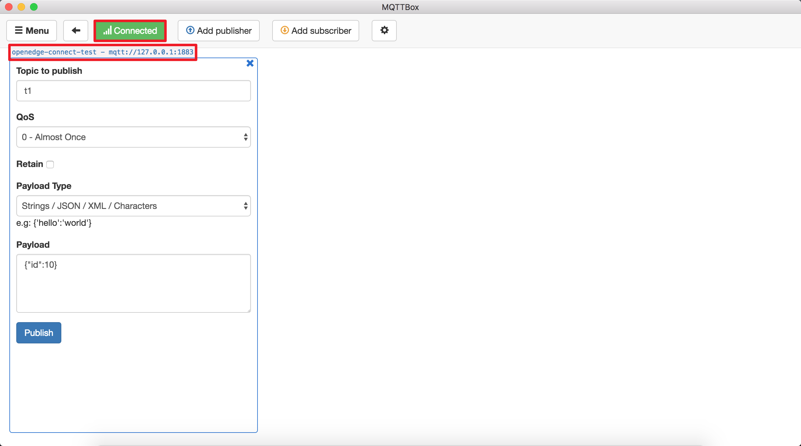
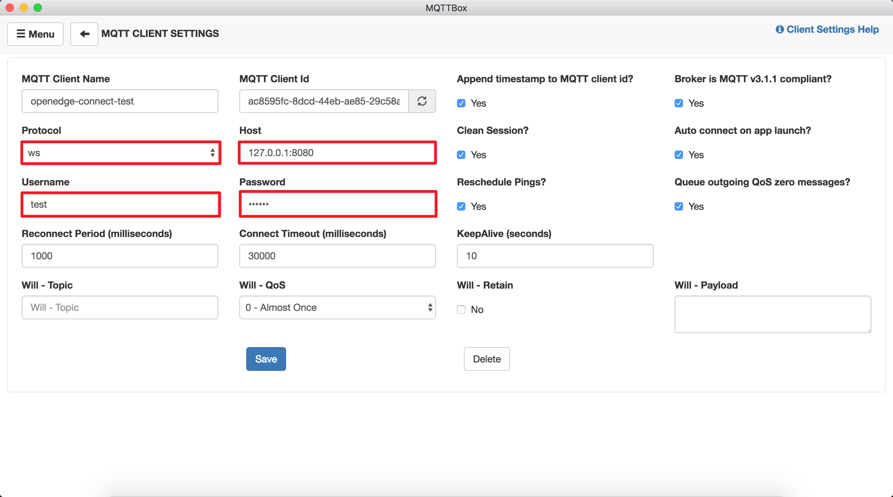
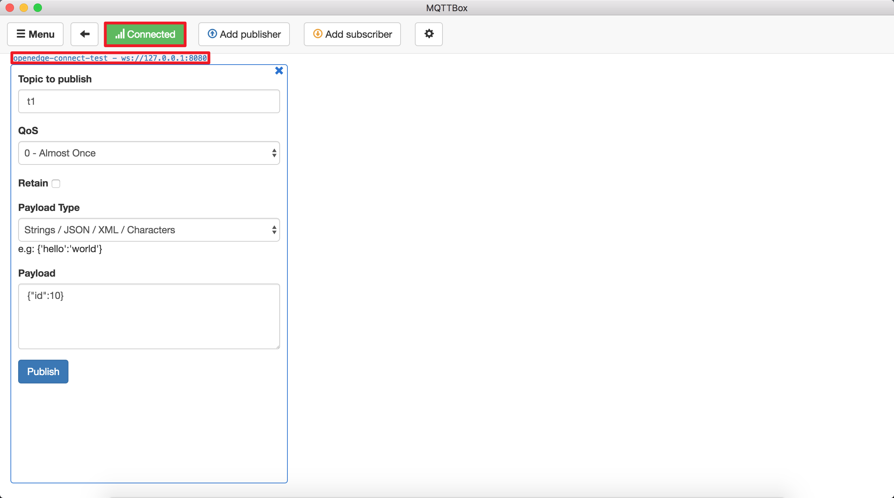
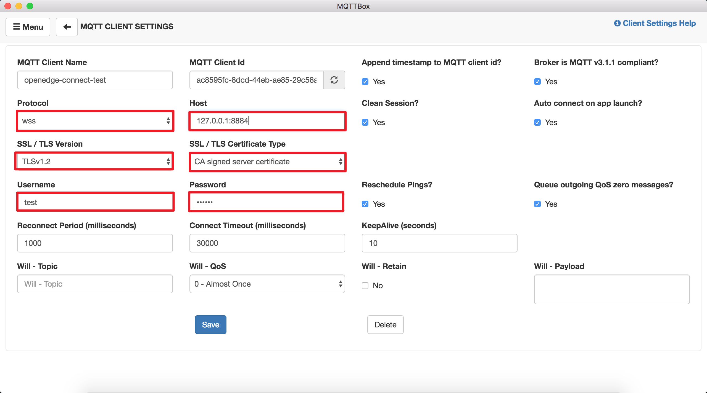

# 连接测试前准备

**声明**：本文测试所用设备系统为MacOS，模拟MQTT client行为的客户端为[MQTTBOX](http://workswithweb.com/html/mqttbox/downloads.html)。

OpenEdge Hub模块启动所依赖的配置项如下：

```yaml
name: [必须]模块名
listen: [必须]监听地址，例如：
  - tcp://0.0.0.0:1883 # Native进程模式下，如果不想暴露给宿主机外的设备访问，可以改成tcp://127.0.0.1:1883
  - ssl://0.0.0.0:1884
  - ws://:8080/mqtt
  - wss://:8884/mqtt
certificate: SSL/TLS证书认证配置项，如果启用ssl或wss必须配置
  ca: mqtt server CA证书所在路径
  key: mqtt server 服务端私钥所在路径
  cert: mqtt server 服务端公钥所在路径
principals: 接入权限配置项，如果不配置则mqtt client无法接入hub，支持账号密码和证书认证
  - username: mqtt client接入hub的用户名
    password: mqtt client接入hub的密码
    permissions:
      - action: 操作权限。pub：发布权限；sub：订阅权限
        permit: 操作权限允许的主题列表，支持+和#匹配符
```

如上配置，本地Hub模块可支持TCP、SSL、WS（Websocket）及WSS（Websocket + SSL）四种连接方式。

_**提示**：要求部署、启动OpenEdge的设备系统已安装好Docker，详见[在MacOS系统上快速部署OpenEdge](../start/Deploy-OpenEdge-on-MacOS.md)。_


# 操作流程

- **Step1**：依据使用需求编写配置文件信息，然后以Docker容器模式启动OpenEdge可执行程序；
- **Step2**：依据选定的连接测试方式，对MQTTBOX作相应配置；
    - 若采用TCP连接，则仅需配置用户名、密码（参见配置文件principals配置项username、password），并选定对应连接端口即可；
    - 若采用SSL证书认证，除选定所需的用户名、密码外，还需选定ca证书或是由ca签发的服务端公钥证书，依据对应的连接端口连接即可；
    - 若采用WS连接，与TCP连接配置一样，仅需更改连接端口即可；
    - 若采用WSS连接，与SSL连接配置一样，仅需更改连接端口即可。
- **Step3**：若上述步骤一切正常，操作无误，即可通过OpenEdge日志或MQTTBOX查看连接状态。

# 连接测试

如上所述，进行设备连接OpenEdge测试前，须提前启动OpenEdge。

## OpenEdge 启动

依据**Step1**，以Docker容器模式启动OpenEdge，正常启动的情况如下图所示。


可以看到，OpenEdge正常启动后，OpenEdge_Hub模块镜像已被加载。另外，亦可以通过命令`docker ps`查看系统当前正在运行的容器。


## MQTTBOX 连接测试

OpenEdge Hub模块启动的连接相关配置信息如下：

```yaml
name: openedge_hub
listen:
  - tcp://:1883
  - ssl://:1884
  - ws://:8080/mqtt
  - wss://:8884/mqtt
certificate:
  ca: 'app/cert-4j5vze02r/ca.pem'
  cert: 'app/cert-4j5vze02r/server.pem'
  key: 'app/cert-4j5vze02r/server.key'
principals:
  - username: 'test'
    password: 'be178c0543eb17f5f3043021c9e5fcf30285e557a4fc309cce97ff9ca6182912'
    permissions:
      - action: 'pub'
        permit: ['#']
      - action: 'sub'
        permit: ['#']
```

如上所述，OpenEdge Hub模块启动时会同时开启1883、1884、8080及8884端口，分别用作TCP、SSL、WS（Websocket）及WSS（Websocket + SSL）等几种方式进行连接，下文将以MQTTBOX作为MQTT Client，测试MQTTBOX分别在上述这几种连接方式情况下与OpenEdge的连接情况，具体如下。

### TCP 连接测试

启动MQTTBOX客户端，直接进入client创建页面，开始创建MQTT client，选择连接使用的协议为“mqtt/tcp”，依据OpenEdge Hub模块启动的地址及端口，再结合principals配置项中可连接OpenEdge Hub模块的MQTT client的连接配置信息进行配置，然后点击“Save”按钮，即可完成TCP连接模式下MQTTBOX的连接配置，具体如下图示。


在点击“Save”按钮后，MQTTBOX会自动跳转到连接状态页面，若连接配置信息与OpenEdge Hub模块principals配置项中可允许连接的MQTT client信息吻合，即可看到连接成功的标志，具体如下图示。



### SSL 连接测试

与TCP连接配置类似，对于SSL连接的测试，MQTTBOX连接配置协议选择“mqtts/tls”，相应地，端口选择1884，SSL/TLS协议版本选择“TLSv1.2”，证书选择“CA signed server certificates”，并输入对应的连接用户名和密码，然后点击“Save”按钮，具体配置如下图示。


若上述操作无误，配置信息与OpenEdge Hub模块principals配置项中可允许连接的MQTT client信息吻合，即可在MQTTBOX页面看到“连接成功”的标志，具体如下图示。


### WS（Websocket）连接测试

同TCP连接配置，这里仅须更改连接协议为“ws”，端口选择8080，其他与TCP连接配置相同，然后点击“Save”按钮，具体如下图示。



只要上述操作正确、无误，即可在MQTTBOX看到与OpenEdge Hub成功建立连接的标志，具体如下图示。



### WSS（Websocket + SSL）连接测试

与SSL连接配置类似，这里只需要更改连接协议为“wss”，同时连接端口采用8884，点击“Save”按钮，具体如下图示。



正常情况下，即可通过MQTTBOX看到其已通过“wss://127.0.0.1:8884”地址与OpenEdge Hub模块成功建立了连接，具体如下图示。


综上，我们通过MQTTBOX顺利完成了与OpenEdge Hub模块的连接测试，除MQTTBOX之外，我们还可以通过MQTT.fx或Paho MQTT自己编写测试脚本测试与OpenEdge Hub 的连接，具体参见[相关下载](../other/MQTT-download.md)。
