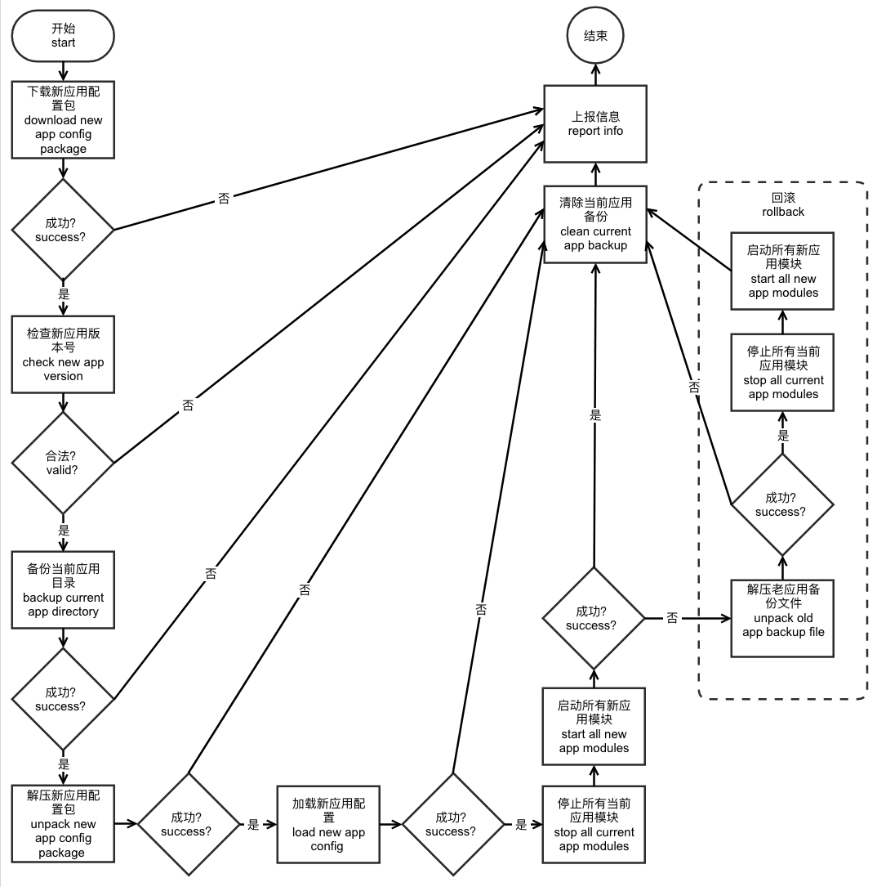
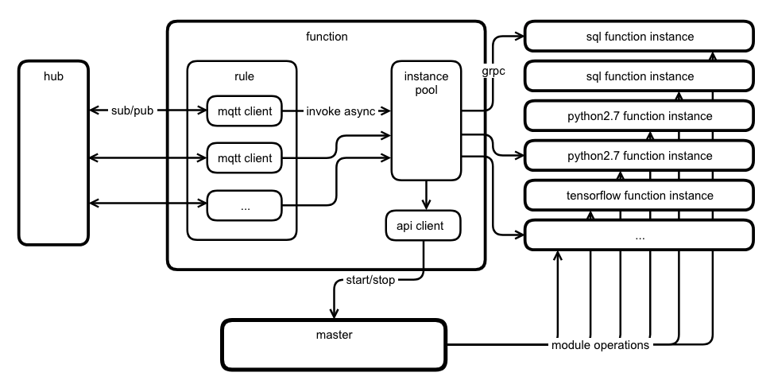

# OpenEdge

OpenEdge 由主程序和应用模块构成，通过加载应用配置来运行模块，目前支持两种运行模式，分别是 **Docker** 容器模式和 **Native** 进程模式。

Docker 容器模式结构图:


Native 进程模式结构图:


## 主程序(master)

[主程序](https://github.com/baidu/openedge/tree/5010a0d8a4fc56241d5febbc03fdf1b3ec28905e/master/master.go)负责所有模块的管理、云同步等，由模块引擎、云代理和API构成。

### 模块引擎(engine)

[模块引擎](https://github.com/baidu/openedge/tree/5010a0d8a4fc56241d5febbc03fdf1b3ec28905e/engine/engine.go)负责模块的启动、停止、重启、监听和守护，目前支持docker容器模式和native进程模式。

模块引擎从工作目录的 [var/db/openedge/module/module.yml](https://github.com/baidu/openedge/tree/5010a0d8a4fc56241d5febbc03fdf1b3ec28905e/example/docker/var/db/openedge/module/module.yml) 配置中加载模块列表，并以列表的顺序逐个启动模块。模块引擎会为每个模块启动一个守护协程对模块状态进行监听，如果模块异常退出，会根据模块的 [Restart Policy](../tutorials/local/Config-interpretation.md#应用配置) 配置项执行重启或退出。主程序关闭后模块引擎会按照列表的逆序逐个关闭模块。

_**提示**：工作目录可在 OpenEdge 启动时通过 `-w` 指定，默认为 OpenEdge 的可执行文件所在目录的上一级目录。_

Docker 容器模式下，模块通过 Docker Client 启动 `entry` 指定的模块镜像，并自动加入自定义网络（openedge）中，由于 Docker 自带了 DNS Server，模块间可通过模块名进行互相通讯。另外模块可通过 `expose` 配置项来向外暴露端口；通过 `resources` 配置项限制模块可使用的资源，目前支持 CPU、内存和进程数的限制。[配置参考](../tutorials/local/Config-interpretation.md#应用配置)

Docker 容器模式下，模块在容器中的工作目录是根目录：/，配置路径是：/etc/openedge/module.yml，资源读取目录是：/var/db/openedge/module/<模块名>，持久化数据输出目录是：/var/db/openedge/volume/<模块名>，日志输出目录是：/var/log/openedge/<模块名>。具体的映射如下：

> - \<openedge_host_work_dir>/var/db/openedge/module/<module_name>/module.yml:/etc/openedge/module.yml
> - \<openedge_host_work_dir>/var/db/openedge/module/<module_name>:/var/db/openedge/module/<module_name>
> - \<openedge_host_work_dir>/var/db/openedge/volume/<module_name>:/var/db/openedge/volume/<module_name>
> - \<openedge_host_work_dir>/var/log/openedge/<module_name>:/var/log/openedge/<module_name>

_**提示**：应用模块在云端被修改后 mark 值会发生变化，和 git 的修订版本类似。_

Native 进程模式下，通过 syscall 启动 `entry` 指定模块可执行文件，模块间可通过 localhost（127.0.0.1）进行互相通讯，**不支持资源隔离和资源限制**。

### 云代理(agent)

云代理负责和云端管理套件通讯，走 MQTT 和 HTTPS 通道，MQTT 强制 SSL/TLS 证书双向认证，HTTPS 强制 SSL/TLS 证书单向认证。配置参考 [cloud](../tutorials/local/Config-interpretation.md#主程序配置)。

OpenEdge 启动和热加载（reload）完成后会通过云代理上报一次设备信息，目前[上报的内容](https://github.com/baidu/openedge/tree/5010a0d8a4fc56241d5febbc03fdf1b3ec28905e/agent/report.go)如下：

> - go_version：OpenEdge 主程序的 Golang 版本
> - bin_version：OpenEdge 主程序的版本
> - conf_version：OpenEdge 主程序加载应用的版本
> - error：OpenEdge 主程序异常信息，如果有的话
> - os：设备的系统，比如：linux、windows、darwin
> - bit：设备 CPU 位数，比如：32、64
> - arch：设备 CPU 架构，比如：amd64
> - gpu\<n\>：设备的第 n 个 GPU 的型号
> - gpu\<n\>_mem_total：设备的第 n 个 GPU 的显存总容量
> - gpu\<n\>_mem_free：设备的第 n 个 GPU 的显存剩余容量
> - mem_total：设备的内存总容量
> - mem_free：设备的内存剩余容量
> - swap_total：设备的交换空间总容量
> - swap_free：设备的交换空间剩余容量

云代理接收到云端管理套件的应用下发指令后，OpenEdge 开始执行[热加载](https://github.com/baidu/openedge/tree/5010a0d8a4fc56241d5febbc03fdf1b3ec28905e/master/master.go)，流程如下图：



_**注意**：目前热加载采用全量更新的方式，即先停止所有老应用模块再启动所有新应用模块，因此模块提供的服务会中断。另外解压新应用包会直接覆盖老应用的文件，多余的老应用文件不会被清理，后续会考虑加入清理逻辑。_

_**提示**：如果设备无法连接外网或者脱离云端管理，可移除 `cloud` 配置项，离线运行。_

### API(api)

OpenEdge 主程序会暴露一组 HTTP API，目前支持获取空闲端口，模块的启动和停止。API Server 在 Linux 系统下默认采用 Unix Domain Socket，工作目录下的 `var/openedge.sock`；其他环境采用 TCP，默认监听 `tcp://127.0.0.1:50050`。开发者可以通过 [api](../tutorials/local/Config-interpretation.md#主程序配置)配置项修改监听的地址。为了方便管理，我们对模块做了一个划分，从 [var/db/openedge/module/module.yml](https://github.com/baidu/openedge/tree/5010a0d8a4fc56241d5febbc03fdf1b3ec28905e/example/docker/var/db/openedge/module/module.yml) 中加载的模块称为常驻模块，通过 API 启动的模块称为临时模块，临时模块遵循谁启动谁负责停止的原则。OpenEdge 退出时，会先逆序停止所有常驻模块，常驻模块停止过程中也会调用 API 来停止其启动的模块，最后如果还有遗漏的临时模块，会随机全部停止。访问 API 需要提供账号和密码，设置如下两个请求头：

> - x-iot-edge-username：账号名称，即常驻模块名
> - x-iot-edge-password：账号密码，即常驻模块的 token，使用```module.GetEnv(module.EnvOpenEdgeModuleToken)```从环境变量中获取，OpenEdge 主程序启动时会为每个常驻模块生成临时的 token。

官方提供的函数计算模块会调用这个 API 来启停函数实例（runtime）模块，函数计算模块停止时需要负责将其启动的临时模块全部停掉。

### 环境变量(env)

OpenEdge 目前会给模块设置如下几个系统环境变量：

> - OPENEDGE_HOST_OS：OpenEdge 所在设备（宿主机）的系统类型
> - OPENEDGE_MASTER_API：OpenEdge 主程序的 API 地址
> - OPENEDGE_MODULE_MODE：OpenEdge 主程序的运行模式
> - OPENEDGE_MODULE_TOKEN：OpenEdge 主程序分配给常驻模块的临时 token，可作为常驻模块访问主程序 API 的密码

官方提供的函数计算模块就是通过读取 `OPENEDGE_MASTER_API` 来连接 OpenEdge 主程序的，比如 Linux 系统下 `OPENEDGE_MASTER_API` 默认是 `unix://var/openedge.sock`；其他系统的 Docker 容器中 `OPENEDGE_MASTER_API` 默认是 `tcp://host.docker.internal:50050`；其他系统的 Native 模式下 `OPENEDGE_MASTER_API` 默认是 `tcp://127.0.0.1:50050`。

_**注意**：应用中配置的环境变量如果和上述系统环境变量相同会被覆盖。_

## 官方模块

目前官方提供了若干模块，用于满足部分常见的应用场景，当然开发者也可以开发自己的模块，只要符合自定义模块的加载要求。

### Hub 模块（openedge-hub）

Hub 模块是一个单机版的消息订阅和发布中心，采用 MQTT 3.1.1协议，结构图如下：


目前支持4种接入方式：TCP、SSL（TCP + SSL）、WS(Websocket)及 WSS（Websocket + SSL），MQTT 协议支持度如下：

> - 支持 Connect、Disconnect、Subscribe、Publish、Unsubscribe、Ping 等功能
> - 支持 QoS 等级 0 和 1 的消息发布和订阅
> - 支持 Retain、Will message、Clean Session
> - 支持订阅含有 `+`、`#` 等通配符的主题
> - 支持符合约定的 ClientID 和 Payload 的校验
> - 暂时 **不支持** 发布和订阅以 `$` 为前缀的主题
> - 暂时 **不支持** Client 的 Keep Alive 特性以及 QoS 等级 2 的发布和订阅

_**注意**：_

> - 发布和订阅主题中含有的分隔符 `/` 最多不超过 8 个，主题名称长度最大不超过 255 个字符
> - 消息报文默认最大长度位 `32k`，可支持的最大长度为 268,435,455(Byte)，约 256 MB，可通过 `message` 配置项进行修改
> - ClientID 支持大小写字母、数字、下划线、连字符（减号）和空字符(空字符表示 Client 为临时连接，强制 CleanSession = True), 最大长度不超过 128 个字符
> - 消息的 QoS 只能降不能升，比如原消息的 QoS 为 0 时，即使订阅 QoS 为 1，消息仍然以 QoS 为 0 的等级发送。

Hub模块支持简单的主题路由，比如订阅主题为 `t` 的消息并以新主题 `t/topic` 发布回 broker。[参考配置](https://github.com/baidu/openedge/tree/5010a0d8a4fc56241d5febbc03fdf1b3ec28905e/example/docker/var/db/openedge/module/localhub/module.yml)

#### 函数计算模块（openedge-function）

函数计算提供基于 MQTT 消息机制，弹性、高可用、扩展性好、响应快的的计算能力，并且兼容[百度云-函数计算 CFC](https://cloud.baidu.com/product/cfc.html)。函数通过一个或多个具体的实例执行，每个实例都是一个独立的进程，现采用 GRPC Server 运行函数实例。所有函数实例由实例池（Pool）负责管理生命周期，支持自动扩容和缩容。结构图如下：



_**注意**: 如果函数执行错误，函数计算会返回如下格式的消息，供后续处理。其中 packet 是函数输入的消息（被处理的消息），不是函数返回的消息。_

```python
{
    "errorMessage": "rpc error: code = Unknown desc = Exception calling application",
    "errorType": "*errors.Err",
    "packet": {
        "Message": {
            "Topic": "t",
            "Payload": "eyJpZCI6MSwiZGV2aWNlIjoiMTExIn0=",
            "QOS": 0,
            "Retain": false
        },
        "Dup": false,
        "ID": 0
    }
}
```

#### 函数计算 Python 运行时模块（openedge-function-runtime-python27）

Python 函数与[百度云-函数计算 CFC](https://cloud.baidu.com/product/cfc.html)类似，用户通过编写的自己的函数来处理消息，可进行消息的过滤、转换和转发等，使用非常灵活。

Python 函数的输入输出可以是 JSON 格式也可以是二进制形式。消息 Payload 在作为参数传给函数前会尝试一次 JSON 解码（`json.loads(payload)`），如果成功则传入字典（dict）类型，失败则传入原二进制数据。

Python 函数支持读取环境变量，比如 os.environ['PATH']。

Python 函数支持读取上下文，比如 context['functionName']。

Python 函数实现举例：

```python
#!/usr/bin/env python
#-*- coding:utf-8 -*-
"""
module to say hi
"""

def handler(event, context):
    """
    function handler
    """
    event['functionName'] = context['functionName']
    event['functionInvokeID'] = context['functionInvokeID']
    event['functionInstanceID'] = context['functionInstanceID']
    event['messageQOS'] = context['messageQOS']
    event['messageTopic'] = context['messageTopic']
    event['sayhi'] = '你好，世界！'
    return event
```

_**提示**：Native 进程模式下，若要运行本代码库提供的 [sayhi.py](https://github.com/baidu/openedge/tree/5010a0d8a4fc56241d5febbc03fdf1b3ec28905e/example/native/var/db/openedge/module/func-nyeosbbch/sayhi.py)，需要自行安装 python2.7，且需要基于 python2.7 安装 protobuf3、grpcio、pyyaml (采用 pip 安装即可，`pip install grpcio protobuf pyyaml`)。_

此外，对于 Native 进程模式 Python 脚本运行环境的构建，推荐通过 virtualenv 构建虚拟环境，并在此基础上安装相关依赖，相关步骤如下：

> ```python
> # install virtualenv via pip
> [sudo] pip install virtualenv
> # test your installation
> virtualenv --version
> # build workdir run environment
> cd /path/to/native/workdir
> virtualenv native/workdir
> # install requirements
> source bin/activate # activate virtualenv
> pip install grpcio protobuf pyyaml # install grpc, protobuf3, yaml via pip
> # test native mode
> bin/openedge # run openedge under native mode
> deactivate # deactivate virtualenv
> ```

### 远程通讯模块（openedge-remote-mqtt）

远程通讯模块目前支持 MQTT 协议，可桥接两个 MQTT Server 的消息并转发给另一个 Server。目前支持配置多路消息转发，可配置多个 Remote 和 Hub 同时进行消息同步，结构图如下：


如上图示，这里，OpenEdge 本地 Hub 模块与远程云端 Hub 平台之间通过 OpenEdge 远程通讯模块（openedge-remote-mqtt）实现消息的转发、同步，进一步地，通过在两端接入 MQTT Client 即可实现 **端云协同式** 的消息转发与传递。
