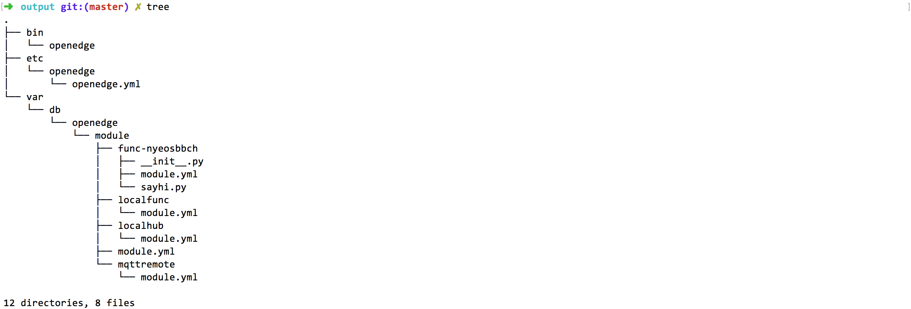

# 部署前准备

本文主要概述如何在MacOS上快速部署、运行OpenEdge，假定在此之前OpenEdge运行所需[环境配置](../setup/OpenEdge-build-prepare.md)均已Ready。

 - OpenEdge容器化模式运行要求运行设备已安装好并启动Docker服务；

**需要说明的是**：本文所提及的在MacOS系统是基于MacOS High Sierra Version 10.13.6版本，相关kernel内核版本信息如下图示。

# 部署流程

- **Step1**：从OpenEdge github开源项目中选择某release版本[下载](https://github.com/baidu/openedge/releases)。
- **Step2**：打开终端，进入OpenEdge软件包下载目录，进行解压缩操作；
	- 如果下载的是zip压缩包，执行命令`unzip -d . openedge-xxx.zip`；
	- 如题下载的是tar.gz压缩包，执行命令`tar -zxvf openedge-xxx.tar.gz`；
- **Step3**：完成解压缩操作后，直接进入OPenEdge程序包目录，执行命令`bin/openedge`，然后分别查看OpenEdge启动、加载日志信息，及查看当前正在运行的容器（通过命令`docker ps`），并对比二者是否一致（假定当前系统中未启动其他docker容器）；
- **Step4**：若查看结果一致，则表示OpenEdge已正常启动。

# 开始部署

如上所述，首先从OpenEdge github开源项目中下载某版本的OpenEdge（源码编译亦可，参见[Linux环境下编译OpenEdge](../setup/Source.md)），然后打开终端进入OpenEdge程序包下载目录，进行解压缩操作，成功解压缩后，可以发现openedge目录中主要包括bin、etc、var等目录，具体如下图示。

其中，bin目录存储openedge二进制可执行程序，etc目录存储了openedge程序启动的配置，var目录存储了模块启动的配置和资源。

然后，执行命令`docker ps`查看当前正在运行的容器列表，如下图示；

可以发现，当前系统并未有正在运行的docker容器。

接着，进入解压缩后的OpenEdge文件夹下，执行命令`bin/openedge`，观察终端OpenEdge启动、加载日志，如下图示；

显然，OpenEdge已经成功启动。

最后，再次执行命令`docker ps`观察当前正在运行的Docker容器列表，不难发现openedge-hub、openedge-function、openedge-remote-mqtt等模块已经成功启动，具体如下图示。

如上所述，若各步骤执行无误，即可完成OpenEdge在MacOS系统上的快速部署、启动。
