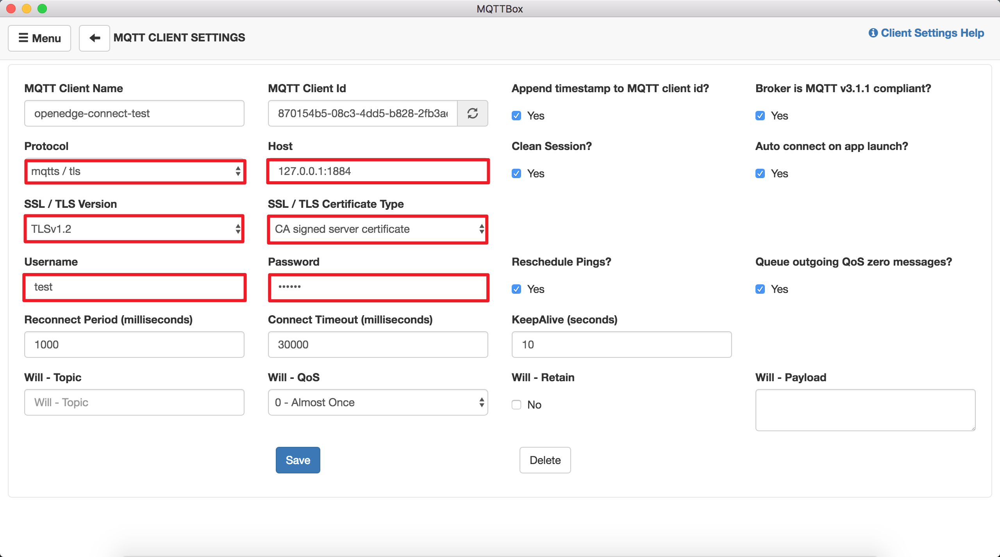
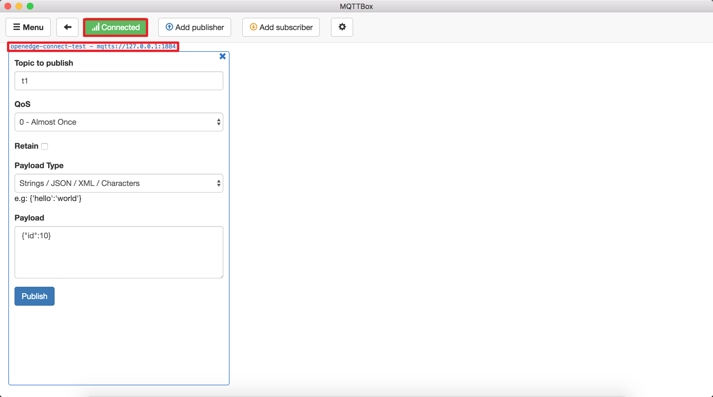

# 通过 Hub 模块将设备接入 OpenEdge

**声明**：

> + 本文测试所用设备系统为Darwin
> + 模拟MQTT client行为的客户端为[MQTT.fx](../Resources-download.md#下载MQTT.fx客户端)
> + 本文所用镜像为依赖OpenEdge源码自行编译所得，具体请查看[如何从源码构建镜像](../setup/Build-OpenEdge-from-Source.md)

OpenEdge Hub模块的完整的配置参考[Hub模块配置](./Config-interpretation.md#Hub模块配置)。

_**提示**：要求部署、启动OpenEdge的设备系统已安装好Docker，详见[在Darwin系统上快速部署OpenEdge](../quickstart/Deploy-OpenEdge-on-Darwin.md)。_

## 操作流程

- Step 1：依据使用需求编写配置文件信息，然后以Docker容器模式启动OpenEdge可执行程序；
- Step 2：依据选定的连接测试方式，对MQTT.fx作相应配置；
    - 若采用TCP连接，则仅需配置用户名、密码（参见配置文件principals配置项username、password），并选定对应连接端口即可；
    - 若采用SSL证书认证，除选定所需的用户名、密码外，还需选定ca证书或是由ca签发的服务端公钥证书，依据对应的连接端口连接即可；
    - 若采用WS连接，与TCP连接配置一样，仅需更改连接端口即可；
    - 若采用WSS连接，与SSL连接配置一样，仅需更改连接端口即可。
- Step 3：若上述步骤一切正常，操作无误，即可通过OpenEdge日志或MQTT.fx查看连接状态。

_**提示**：配置文件principals配置项中password要求采用原password明文SHA256值存储，但MQTT.fx作连接配置时，要求使用原password明文。_

## 连接测试

如上所述，进行设备连接OpenEdge测试前，须提前启动OpenEdge。

### OpenEdge 启动

依据 `Step 1`，以 Docker 容器模式启动 OpenEdge，正常启动的情况如下图所示。


可以看到，OpenEdge正常启动后，Hub模块镜像已被加载。另外，亦可以通过命令`docker ps`查看系统当前正在运行的容器。


### MQTT.fx 连接测试

OpenEdge Hub模块启动的连接相关配置信息如下：

```yaml
name: localhub
listen:
  - tcp://:1883
  - ssl://:1884
  - ws://:8080/mqtt
  - wss://:8884/mqtt
certificate:
  ca: 'var/db/openedge/modulehub/cert-4j5vze02r/ca.pem'
  cert: 'var/db/openedge/modulehub/cert-4j5vze02r/server.pem'
  key: 'var/db/openedge/modulehub/cert-4j5vze02r/server.key'
principals:
  - username: 'test'
    password: 'be178c0543eb17f5f3043021c9e5fcf30285e557a4fc309cce97ff9ca6182912'
    permissions:
      - action: 'pub'
        permit: ['#']
      - action: 'sub'
        permit: ['#']
```

如上所述，Hub模块启动时会同时开启1883、1884、8080及8884端口，分别用作TCP、SSL、WS（Websocket）及WSS（Websocket + SSL）等几种方式进行连接，下文将以MQTT.fx作为MQTT Client，测试MQTT.fx分别在上述这几种连接方式情况下与OpenEdge的连接情况，具体如下。

**TCP 连接测试**

启动MQTT.fx客户端，直接进入client创建页面，开始创建MQTT client，选择连接使用的协议为“mqtt/tcp”，依据OpenEdge Hub模块启动的地址及端口，再结合principals配置项中可连接OpenEdge Hub模块的MQTT client的连接配置信息进行配置，然后点击“Save”按钮，即可完成TCP连接模式下MQTT.fx的连接配置，具体如下图示。


在点击“Save”按钮后，MQTT.fx会自动跳转到连接状态页面，若连接配置信息与OpenEdge Hub模块principals配置项中可允许连接的MQTT client信息吻合，即可看到连接成功的标志，具体如下图示。


**SSL 连接测试**

与TCP连接配置类似，对于SSL连接的测试，MQTT.fx连接配置协议选择“mqtts/tls”，相应地，端口选择1884，SSL/TLS协议版本选择“TLSv1.2”，证书选择“CA signed server certificates”，并输入对应的连接用户名和密码，然后点击“Save”按钮，具体配置如下图示。



若上述操作无误，配置信息与OpenEdge Hub模块principals配置项中可允许连接的MQTT client信息吻合，即可在MQTT.fx页面看到“连接成功”的标志，具体如下图示。



**WS（Websocket）连接测试**

同TCP连接配置，这里仅须更改连接协议为“ws”，端口选择8080，其他与TCP连接配置相同，然后点击“Save”按钮，具体如下图示。


只要上述操作正确、无误，即可在MQTT.fx看到与OpenEdge Hub成功建立连接的标志，具体如下图示。


**WSS（Websocket + SSL）连接测试**

与SSL连接配置类似，这里只需要更改连接协议为“wss”，同时连接端口采用8884，点击“Save”按钮，具体如下图示。


正常情况下，即可通过MQTT.fx看到其已通过“wss://127.0.0.1:8884”地址与OpenEdge Hub模块成功建立了连接，具体如下图示。


综上，我们通过MQTT.fx顺利完成了与OpenEdge Hub模块的连接测试，除MQTT.fx之外，我们还可以通过MQTT.fx或Paho MQTT自己编写测试脚本测试与OpenEdge Hub 的连接，具体参见[相关资源下载](../Resources-download.md)。
